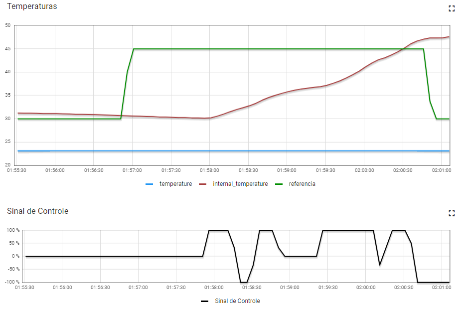

# Projeto 2 - Fundamentos de sistemas embarcados 2022-2

Nome: Victor Amaral Cerqueira
Matrícula: 17/0164411
UnB Campus Gama

## Resumo

Este trabalho tem por objetivo a implementação de um sistema (que simula) o controle de um forno para soldagem de placas de circuito impresso (PCBs).

No trabalho, o aluno deverá desenvolver o software que efetua o controle de temperatura do forno utilizando dois atuadores para este controle: um resistor de potência de 15 Watts utilizado para aumentar temperatura e; uma ventoinha que puxa o ar externo (temperatura ambiente) para reduzir a temperatura do sistema.

## Compilação

Para gerar um arquivo executável, basta utilizar o comando <code>make</code> na raíz do projeto, onde está localizado o arquvio Makefile. 

Um arquivo executável <code>bin</code> será gerado na pasta bin.

## Execução
```
make
bin/bin
```

## Uso

Ao iniciar o programa, será apresentado um menu ao usuário. As informações de temperatura e valor de acionamento da ventoinha/resistor são atualizadas periodicamente.

No menu o usuário deverá selecionar se deseja rodar o sistema no modo Dashboar ou Debug. Digite a opção escolhida e pressione a tecla Enter para confirmar.

* Selecionar a primeira opção autilizando o dashboard fornecido pelo professor para realizar os comandos.
* Selecionar a segunda opção Fornecer as constantes de referência para o controle do PID.

## Relatório

O experimento foi realizado no intervalo de 5 minutos, onde nos primeiros 2 minutos foi deixada a temperatura do resistor estabilizar (30ºC) e a partir disso foi incrementada a temperatura de referência (45ºC) para que se fizesse o acompanhamento das respostas recebidas. O sinal de controle se comportou como esperado, se mantendo em 100% (ligado) até que se ultrapassasse a marca da temperatura de referência, após a ultrapassagem, pode-se acompanhar o sinal de controle variando para que a temperatura do resistor se mantivesse coerente com a temperatura de referência.



### Problemas conhecidos

Por conta de interferência de outros estudantes foi possível notar que em certos momentos o sensor de temperatura retornava um inteiro "-1" como resposta do medidor de temperatura, isso acontecia tanto para temperatura interna quanto para a temperatura de referência.

## Referências

[Enunciado do Trabalho](https://gitlab.com/fse_fga/trabalhos-2022_2/trabalho-2-2022-2)

[Referência de trabalho 1 - Dâmaso Junior](https://github.com/juniopereirab/FSE-Trabalho2)

[Referência de Trabalho 2 - Murilo Loiola](https://gitlab.com/murilo-dan/proj1-fse)
